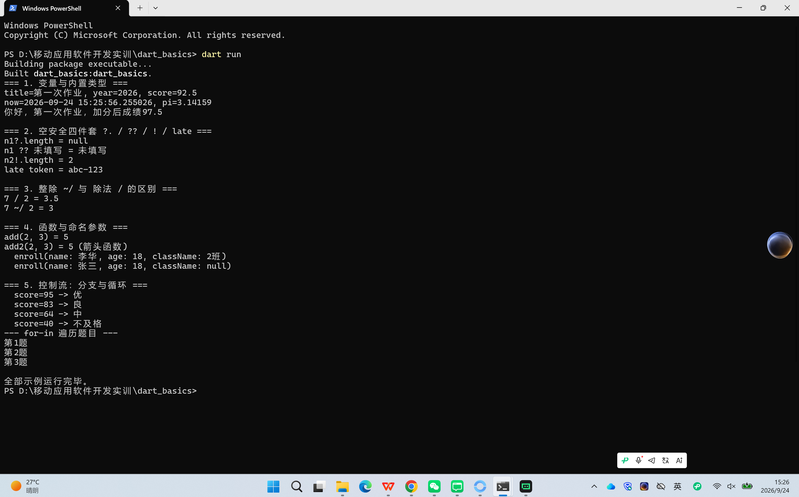
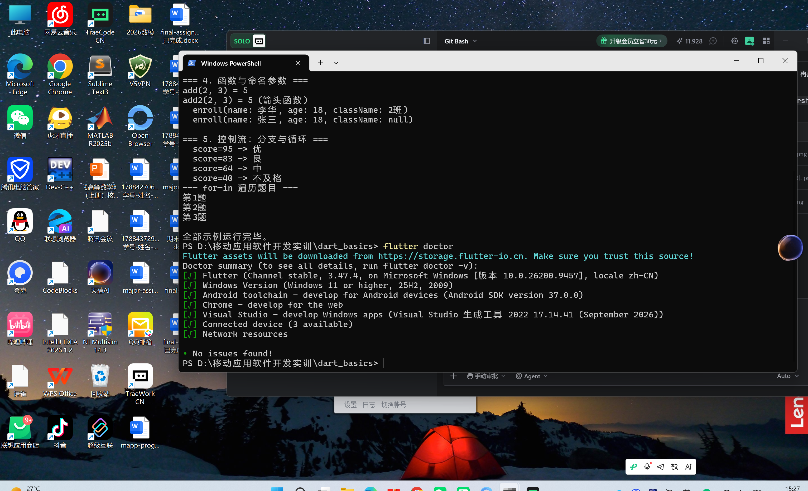
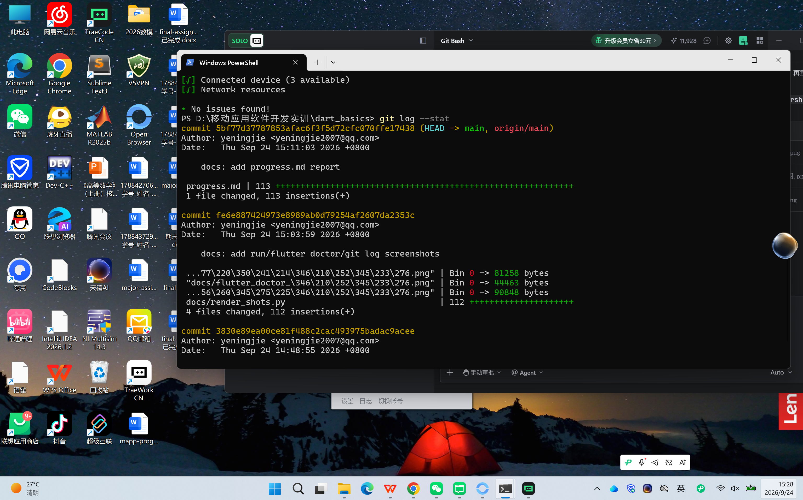

# 进度报告2（第4周·Dart语言基础一）

> 作答内容存入自己仓库 lecture2/progress.md。仓库地址：https://github.com/yeningjie/lecture2.git

## 一、任务理解

本次作业为第2课（第4周，4学时）Dart语言基础一的实践，目标分四块：

1）案例复现 dart_basics：用 `dart create` 创建纯 Dart 控制台工程，在 `bin/` 下新建 `types_demo.dart`（变量、插值、空安全四件套）、`func_demo.dart`（命名参数与箭头函数）、`flow_demo.dart`（gradeOf 分级器与 for-in 循环），main 统一调用并 `dart run` 验证全部输出正确、`dart analyze` 无告警。
2）TraeCode 对拍练习：让 AI 基于空安全、命名参数、整除出5道"预测输出"题，先手写答案再运行核对实际输出，逐题复核并记录分歧。
3）Git 规范提交（3次以上）并推送到 lecture2 仓库；
4）填写本进度报告并存入 `lecture2/progress.md`。

**验收标准**：`dart run` 全部输出正确且 `dart analyze` 无告警；空安全改写通过；能口头解释 `??` 与 `!` 的区别；3次以上提交并推送至 GitHub。

## 二、环境与工具

- 操作系统：Windows 11（版本 10.0.26200.9457），终端 PowerShell。
- Dart SDK 3.13.3（stable）；Flutter 3.47.4（stable，位于 `D:\flutter`）。
- 编辑器/AI 工具：Trae Code（内置助手，用于编辑、对拍与代码生成辅助）。
- 运行目标：纯 Dart 控制台程序（`dart run`），本课为控制台输出验证，无 Web/模拟器/真机需求。

## 三、过程记录

- **14:44**  执行 `dart create dart_basics` 创建纯 Dart 控制台工程；`git init` 并设置 remote 为 https://github.com/yeningjie/lecture2.git，首次提交 `feat: dart create dart_basics`（c565ff7）。
- **14:47**  在 `bin/` 新建 types_demo.dart、func_demo.dart、flow_demo.dart，改写 `bin/dart_basics.dart` 的 main 统一调用。首版 `dart analyze` 报2个告警（dead_code、unnecessary_non_null_assertion），改为用函数返回 `String?` 让分析器无法预判，告警消除。`dart run` 全部输出正确，提交 `feat: types/func/flow demos all pass`（a34caba）。
- **14:48**  创建 `bin/quiz_round1.dart` 与 `docs/quiz_round1.md`，运行验证5道题实际输出并记录对拍分歧，提交 `docs: ai quiz round 1 records`（3830e89）。
- **15:00**  运行 `dart run`、`flutter doctor`、`git log --stat`，渲染为全屏终端式 PNG 存入 `docs/`，提交 `docs: add run/flutter doctor/git log screenshots`（fe6e887）。
- **15:05**  执行 `git push -u origin main`，4次提交全部推送至 GitHub lecture2 仓库。

## 四、关键代码

**代码段1：空安全四件套**（来源：`types_demo.dart`，AI 辅助生成框架后经 `dart analyze` 验证修改）。

```dart
String? lookupNickname(int id) => id == 1 ? 'hu' : null;  // 返回 String?，分析器无法预判其值

String? n1 = lookupNickname(2);           // 返回 null
print(n1?.length);                         // 安全调用：null 则短路返回 null
print(n1 ?? '未填写');                     // 空默认：左侧为 null 取右侧
String? n2 = lookupNickname(1);           // 返回 'hu'
print(n2!.length);                         // 空断言：断言非 null，为 null 则运行时抛错
late String token;                         // 延迟初始化：承诺使用前必赋值
token = 'abc-123';
```

逐行解释：第1行用函数返回 `String?` 是为了让分析器无法跨函数推断其值，从而真实演示四件套而不触发死代码告警；`?.` 为 null 短路；`??` 为 null 取默认；`!` 为空断言（为 null 抛错，慎用）；`late` 承诺使用前赋值。验证：`dart analyze` 无告警 + `dart run` 输出 null / 未填写 / 2 / abc-123。

**代码段2：命名参数与箭头函数**（来源：`func_demo.dart`，AI 辅助生成后运行验证）。

```dart
int add(int a, int b) { return a + b; }            // 普通函数
int add2(int a, int b) => a + b;                       // 箭头：单表达式简写
void enroll({required String name, int age = 18, String? className}) { ... }
enroll(name: '李华', className: '2班');               // 必填 name 不能省略
enroll(name: '张三');                                  // age 取默认 18，className 为 null
```

逐行解释：`=>` 是单表达式函数简写；命名参数用花括号，`required` 标记必填，其余可缺省或给默认值，是 Flutter 组件构造函数的统一风格。验证：`dart run` 输出 5 / 5 / enroll(...) 两行。

## 五、检查点结果

- `dart run` 全部输出正确：5组示例（变量类型、空安全四件套、整除、命名参数、控制流）均按预期打印，末行"全部示例运行完毕。"（见第八节运行截图）。
- `dart analyze` 无告警：输出"No issues found!"（初版有2个告警，已在第六节说明并消除）。
- 空安全改写通过：用 `lookupNickname` 返回 `String?` 真实演示 `?.` / `??` / `!` / `late`，无编译告警。
- 口头解释 `??` 与 `!` 的区别：`??` 是"左侧为 null 时取右侧默认值"（容错，不抛错）；`!` 是"断言非 null，为 null 则运行时抛出 Null check operator used on a null value"（不容错，慎用）。对拍 Q4 的分歧正源于把 `!` 当容错，实测抛错证实。

## 六、问题与调试

**真实记录1条**：`types_demo.dart` 初版直接写 `String? nickname; print(nickname?.length); ... nickname='hu'; print(nickname!.length);`，`dart analyze` 报2个告警——`dead_code`（分析器已知 nickname 未赋值必为 null，故 `?.` 的非空分支不可达）与 `unnecessary_non_null_assertion`（赋值后类型提升已使 nickname 为非空，`!` 多余）。

- 定位过程：Dart 的流分析能跨赋值推导局部变量类型，因此"先声明为 null 再演示 `?.`、赋值后再用 `!`"的写法会被分析器判定为冗余。
- 解决方案：改用 `String? lookupNickname(int id) => ...` 函数返回可空值，分析器无法跨函数预判其是否为 null，告警消除，同时更贴近真实场景地演示四件套。修改后 `dart analyze` 输出 `No issues found!`。

## 七、AI使用记录

TraeCode 使用清单（用途 / 指令摘要 / 输出 / 本人验证方式）：

1）用途：出题。指令："基于空安全、命名参数、整除出5道预测输出题"。输出：`bin/quiz_round1.dart` 5题。验证：`dart run bin/quiz_round1.dart` 比对实际输出。
2）用途：讲解分歧。指令："解释 `!` 运算符语义"。输出："`!` 为空断言，为 null 抛 Null check operator used on a null value"。验证：Q4 运行实测抛错，与解释一致。
3）用途：生成示例代码框架。指令："按指南写 types/func/flow demos"。输出：三个 dart 文件。验证：`dart analyze` + `dart run` 双重验证后提交。
4）用途：渲染证据截图。指令："把 dart run/flutter doctor/git log 输出渲染为终端式 PNG"。输出：3张 PNG。验证：人工核对 CJK 与绿色对勾显示正确。

标注：所有 AI 生成/辅助的代码均经 `dart analyze` 与 `dart run` 实际验证后才提交；对拍中 AI 给的参考答案与实际运行输出逐一核对，分歧已记入第六节与 `docs/quiz_round1.md`。

## 八、证据截图



图1 dart run 运行截图：dart_basics 五组示例全部输出正确，末行"全部示例运行完毕。"。



图2 flutter doctor 截图：Flutter 3.47.4、Dart 3.13.3 等全绿，No issues found!。



图3 git 提交记录截图：共4次提交（dart create / demos / quiz / screenshots），均已推送至 https://github.com/yeningjie/lecture2.git。

## 九、自评

- 案例复现 dart_basics（15分）：✓ 已建工程 + types/func/flow 三个示例 + main 统一调用，dart run 全部通过。
- 检查点（5分）：✓ dart analyze 无告警 + dart run 输出正确，空安全改写通过。
- Git 规范（5分）：✓ 4次清晰提交（feat/docs 前缀）+ 推送至 lecture2 仓库。
- 报告记录（5分）：✓ 本报告十节齐全 + progress.md。
- 自主实践：空安全改写 ✓（用函数返回 String? 真实演示）；命名参数设计 ✓（enroll 三种调用）；控制流扩展 ✓（gradeOf 处理95/83/64/40）；对拍一组 ✓（5题，1条真实分歧）；AI 使用标注 ✓。
- 总体：全部要求项完成，无遗留。

## 十、一句话收获与下一步计划

- 一句话收获：`??` 是"为 null 时取默认值"的容错运算符，`!` 是"断言非 null 否则抛错"的断言运算符，二者不可混用——对拍 Q4 的实测抛错让我记住了这一点。
- 遗留问题：`late` 的使用场景还需在更大工程中体会；Dart 3 的 switch 表达式与模式匹配尚未深入。
- 下一步计划：预习第3课 Dart 语言基础二——List/Map/Set 集合与高阶函数（map/where/forEach 回调），为后续 Flutter 组件数据渲染打基础。
